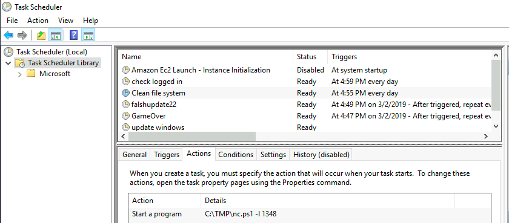
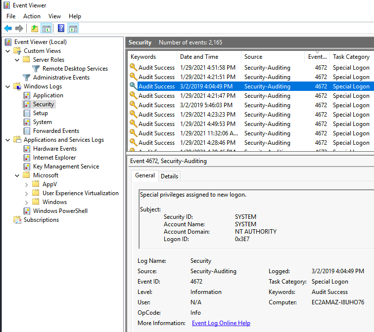

# Investigation Windows

[TryhackMe](https://tryhackme.com/room/investigatingwindows)

## Last logon time for <user>

```net user <user> | findstr /B /C:"Last logon"```

## Users with privilege

### CMD command line

```net user <user>```

### Using tool

The fastest way to open Local Users and Groups is to type **lusrmgr.msc** in the search bar. If you prefer, you can also right-click on the Windows start menu and click on Computer Management. When the new window appears, click on Local Users and Groups, followed by the Groups option.


Locate the Administrators option and double-click on it. The Administrator Properties window should appear, and when it does, you’ll see what accounts have administrative privileges in the Members box.

## Task Scheduled 



## Windows first assign special privileges to a new logon

[Source New Logon](https://docs.microsoft.com/fr-fr/windows/security/threat-protection/auditing/event-4672)



