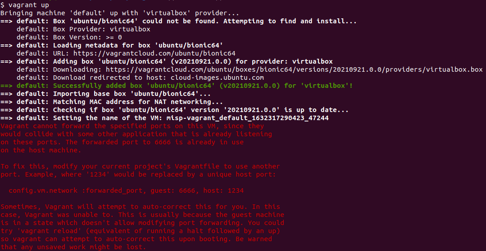

#  Misp
## Misp Vagrant
### 1 - Création d'un user _misp_

```misp$ sudo adduser misp```  

Suivre les instructions de création d'un nouveau user.  

Sur sa machine, se connecter au user _misp_ :
    <br/>```misp$ su - misp```  
    <br/>```misp$ mot de passe : "votre mot de passe"```  

### 2 - Cloner et installer MISP

Aller sur [MISP](https://github.com/MISP/MISP) :  
    <br/>```misp$ git clone https://github.com/MISP/MISP.git```  
    <br/>```misp$ cd MISP/```  

Installation des submodules :  
    <br/>```misp$ git submodule init```  
    <br/>```misp$ git submodule update```  

### 3 - Installer MISP Vagrant

Installation de VirtualBow et vagrant :  
    <br/> ```misp$ sudo apt-get install virtualbox vagrant```  
    <br/>Si l'installation de VirtualBox est en échec, redirigez-vous vers [VirtualBox](https://www.virtualbox.org/wiki/Downloads).  

* Déploiement de MISP Vagrant  
    Rendez-vous sur le repo MISP/        
        <br/>```misp$ cd MISP/```
        <br/>```misp$ git submodule update --init misp-vagrant```
        <br/>```misp$ cd misp-vagrant/```
        <br/>```misp$ git pull origin master```
        <br/>```misp$ vagrant up```
    
    <br/>Si vous recontrez l'erreur suivante : 
    

    <br/>Alors, modifier le fichier suivant _Vagrantfile_ (repo ./MISP/misp-vagrant/.):
        <br/>```misp$ sudo vim Vagrantfile```
    <br/>Modifier la ligne suivante :
        <br/>```config.vm.network :forwarded_port, guest: 6666, host: 6666```
    <br/> par la ligne suivante :
        <br/>```config.vm.network :forwarded_port, guest: 6666, host: 1234```
    <br/>Puis relancer :
    <br/>```misp$ vagrant up```

* Installation de MISP Vagrant sans l'environement de développement  

    Aller sur [MISP Vagrant](https://github.com/MISP/misp-vagrant) :  
        <br/>```misp$ git clone https://github.com/MISP/misp-vagrant.git```  
        <br/>```misp$cd misp-vagrant/```  
        <br/>```misp$ export MISP_ENV='demo'```  
        <br/>```misp$ vagrant up```  

### 4 - Lancement de MISP

    Dès que l'installation de MISP Vagrant (mode développement ou non) est faîte, connecter vous à [misp_web](http://127.0.0.1:5000).

## Mise à Jour de MISP


## Sources

- [MISP](https://www.misp-project.org/features.html)  
- [MISP Vagrant](https://github.com/MISP/misp-vagrant)  


