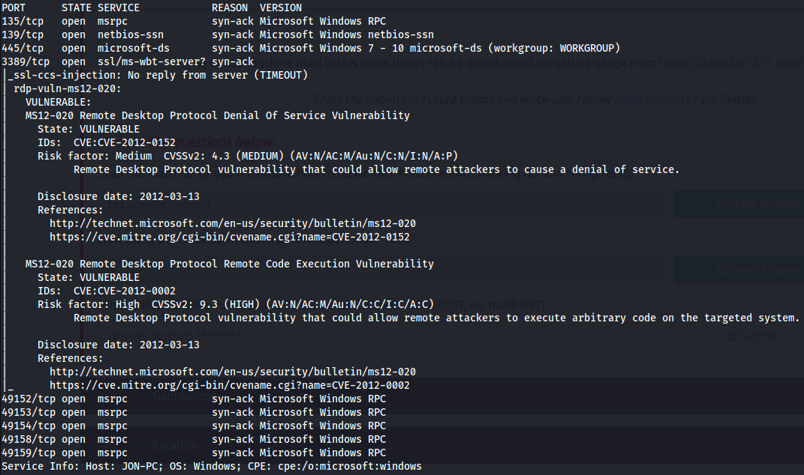
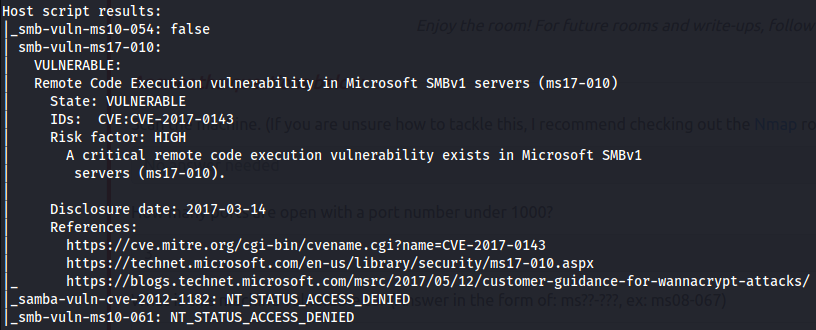

# NMAP

Suffixes : 
* -sV : affiche la version des services existants sur les ports
* -sC : affiche les scripts par défaut qui sont activés sur les ports

Scan simple et rapide : 
* sudo nmap -sS -T5 <ip>

Exemples : 
* N°1 : TryHackMe -> [Ice Room](https://tryhackme.com/room/ice)

    ```$ sudo nmap -sS -Pn -sV 10.10.188.70```

* N°2 : TryHackMe -> [Ice Room](https://tryhackme.com/room/ice)

    ```$ sudo nmap -sS -sC 10.10.188.70```

* N°3 : TryHackMe -> [Kenobi Room](https://tryhackme.com/room/kenobi)

    ```nmap -p 445 --script=smb-enum-shares.nse,smb-enum-users.nse <ip>```
    ```nmap -p 139 --script=smb-enum-shares.nse,smb-enum-users.nse <ip>```

* N°4 : TryHackMe -> [Blue Room](https://tryhackme.com/room/blue)
    
    ```nmap -sV -vv --script vuln 10.10.186.248```

    

    


    


